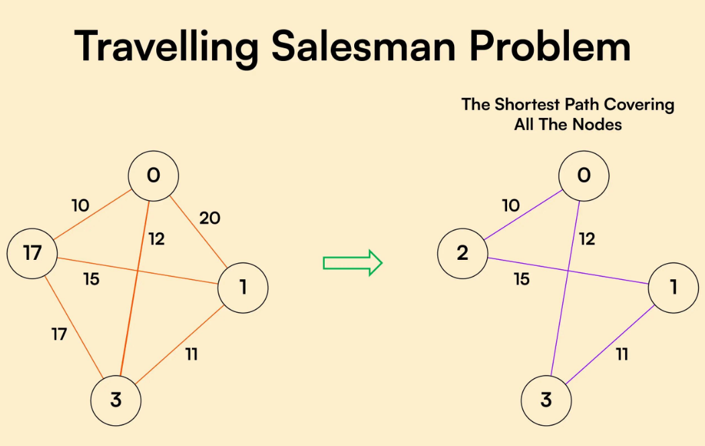

#  Travelling Salesman Problem (TSP)

##  Project Overview
The Travelling Salesman Problem (TSP) is a classic optimization problem where a salesman must visit all cities exactly once and return to the starting point with minimum distance.

This project demonstrates two powerful optimization techniques:
-  Genetic Algorithm (GA)
-  Ant Colony Optimization (ACO)

---

## Genetic Algorithm
- Inspired by natural evolution
- Uses population-based search
- Operators: Selection, Crossover, Mutation
- Provides diverse solutions

---

##  Ant Colony Optimization
- Inspired by ant behavior and pheromones
- Shortest paths get stronger pheromone
- Faster convergence for path problems

---

##  GA vs ACO

    | Feature | GA | ACO |
    |--------|----|----|
    | Inspiration | Evolution | Ant behavior |
    | Speed | Moderate | Fast |
    | Best For | General problems | Path optimization |
    | Convergence | Slower | Faster |

---

## Example Visualization

---

##  Project Files
- 📊 Presentation: `presentation/TSP_GA_ACO_Presentation.pptx`

---

##  Conclusion
Ant Colony Optimization performs better for TSP due to faster convergence and efficient path discovery, while Genetic Algorithm is more flexible for general optimization problems.

---

##  Author
**Pathan Mohammed Akram Khan**  
B.Tech CSE (AI & ML)
Alliance University 
